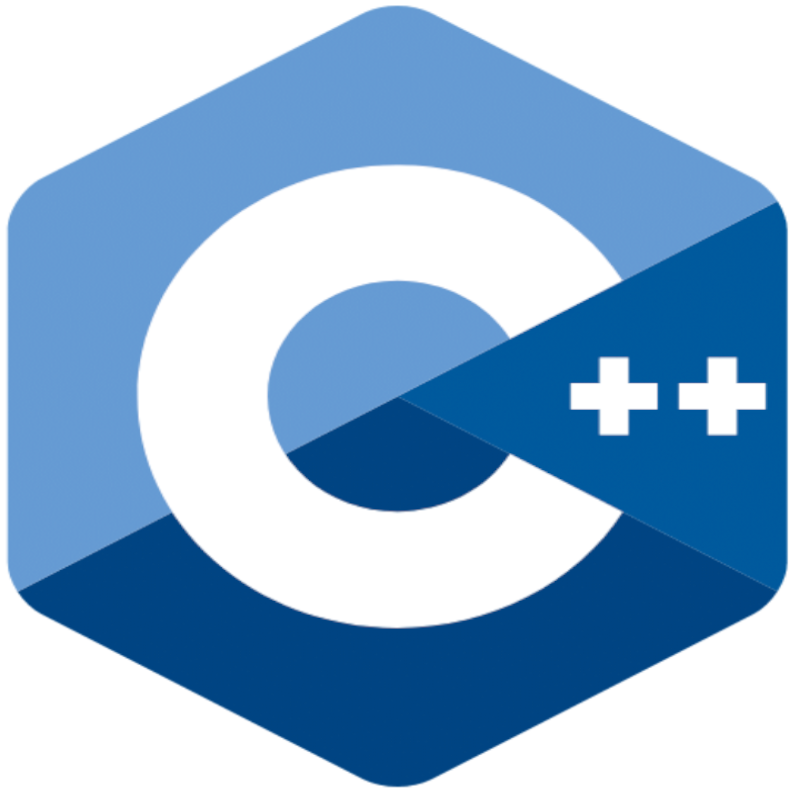
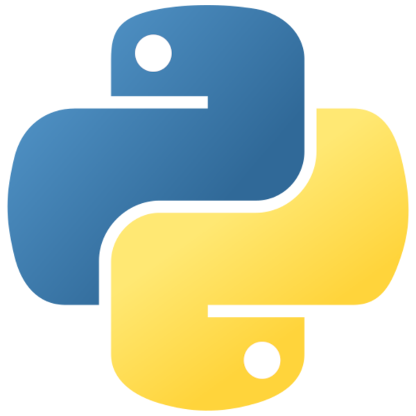
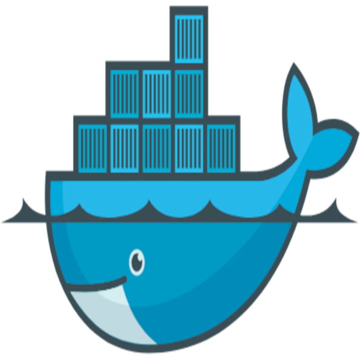

# 🇪🇺 Dezly Macauley

  
  
  
  
  
  
  
  
  
  

_______________________________________________________________________________
### ✉️ Contact Details
- **Email: dezlymacauley@proton.me**
_______________________________________________________________________________
### 🏆 Resume
- **[dezly_macauley_resume.pdf](https://github.com/dezlymacauley/dezlymacauley/blob/main/resume/dezly_macauley_resume.pdf?raw=true)**
_______________________________________________________________________________
