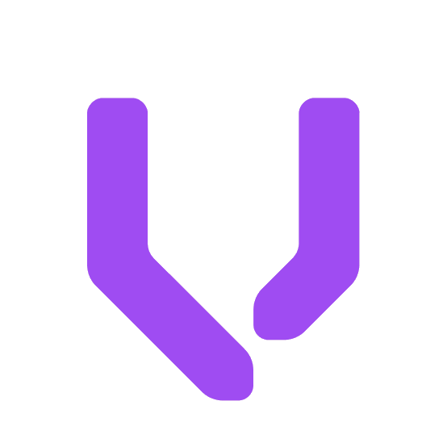

# Dezly Macauley
## Computer Programmer
_______________________________________________________________________________
### Back-End Programming Skills

    

    

        1. Rust
    

_______________________________________________________________________________
### Blockchain Skills

    

    

        1. Vyper
    

_______________________________________________________________________________
### Database Skills

    
    

    

        1. SQLite
    

    

        2. PostgreSQL
    

_______________________________________________________________________________
### Linux Skills

    

    

        1. Arch Linux
    

_______________________________________________________________________________
