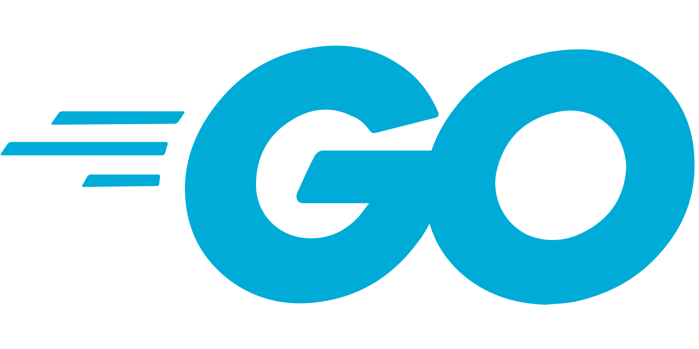
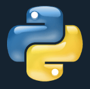

<h1 align="center">🔱 Dezly Macauley 🔱</h1>

    
<strong>Email:</strong> dezlymacauley@proton.me

    

<!---------------------------------------------------------------------------->

<h2 align="center">📜 About Me</h2>

My surname Macauley traces back to Clan MacAulay of Scotland. 
Their motto is "Dulce Periculum", a Latin phrase that means:

"Danger is sweet" 

A fitting motto for someone who is passionate about Rust, 
low-level programming, and eager to learn more about ethical hacking and 
artificial intelligence.

My goal is to live in the European Union. Italy to be specific.
Excluding the European union, my top pick in Europe would be Russia.

🇪🇺 🇮🇹 🇷🇺

<!---------------------------------------------------------------------------->

<h2 align="center">💻 My Development Setup</h2>
<!---------------------------------------------------------------------------->

<ul>
  <li>Arch Linux (My daily Operating system for learning Computer Science)</li>
  <li>Kali Linux on VMware (For learning Application Security)</li>
  <li>Hyprland</li>
  <li>Neovim</li>
  <li>Yazi</li>
  <li>Ghostty</li>
</ul>

<!---------------------------------------------------------------------------->

<h2 align="center">🛠️ My Tech Stack</h2>

<!---------------------------------------------------------------------------->

<table>
<tr>

<!-- First Card -->
<td style="padding:15px; vertical-align:top;">

<h4>Low-Level Programming Languages</h4>

<ul>
  <li>Rust</li>
  <li>C</li>
</ul>

</td>

<!-- Spacer -->
<td style="width: 40px;"></td>

<!-- Second Card -->
<td style="padding:15px; vertical-align:top;">

<h4>Statically-Typed Back-End Languages</h4>

<ul>
  <li>Go</li>
  <li>C#</li>
</ul>

</td>

<!-- Spacer -->
<td style="width: 40px;"></td>

<!-- Third Card -->
<td style="padding:15px; vertical-align:top;">

<h4>Dynamically-Typed Back-End Languages</h4>

<ul>
  <li>Python</li>
</ul>

</td>

</tr>
</table>

<table>
<tr>

<!-- First Card -->
<td style="padding:15px; vertical-align:top;">

<h4>Database Languages</h4>

<ul>
  <li>SQLite</li>
  <li>PostgreSQL</li>
</ul>

</td>

</tr>
</table>

