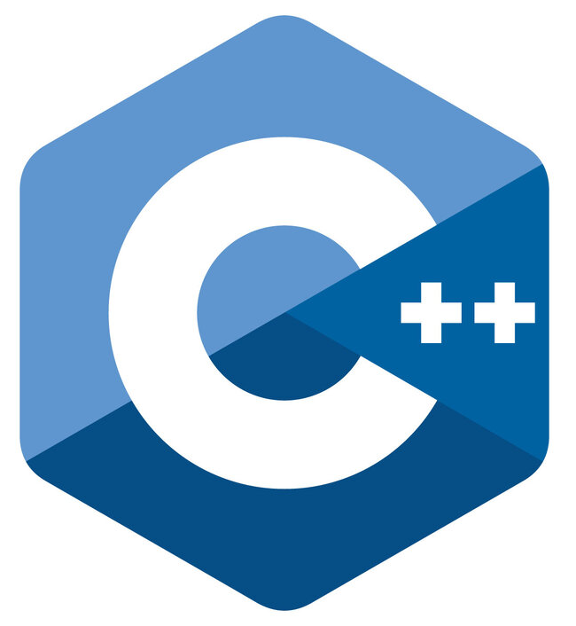
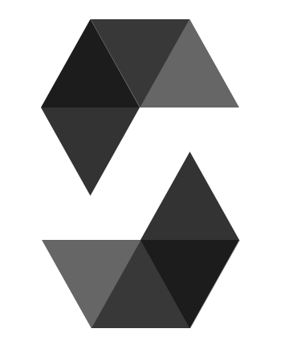
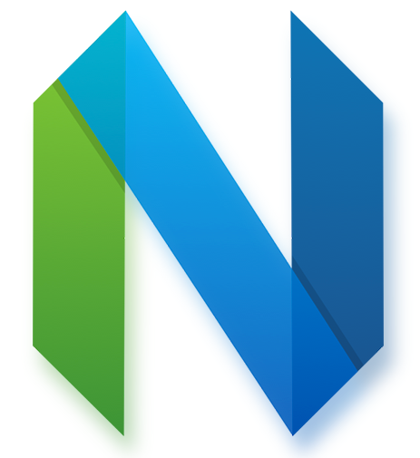
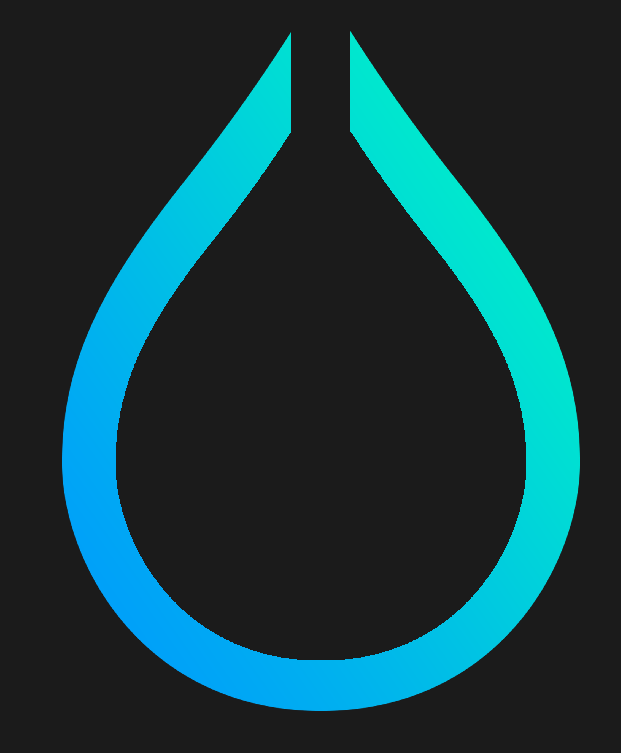
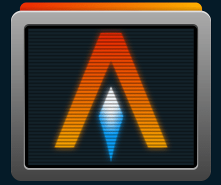

# ☯️ Dezly Macauley

Programming isn't just a means to an end for me. It's an exhilarating journey of constant discovery and innovation. 
My goal is to travel the world and meet like-minded individuals,
who share my passion for programmming and bleeding-edge technologies.
 
 
Low level programming is what interests me the most.

---

### 🔍 My Interests
- **Systems Programming**&ensp; (Rust, C++)
- **Blockchain**&ensp; (Solidity)

---

### ⚔️ My Arsenal
**Rust, C++, Solidity**

 
 

---

### 💻 My Dev Environment: 
- Operating System: **Arch Linux**
- Code Editor: **Neovim**
- Desktop Environment: **Hyprland**
- Terminal Emulator: **Alacritty**

 
 

---
